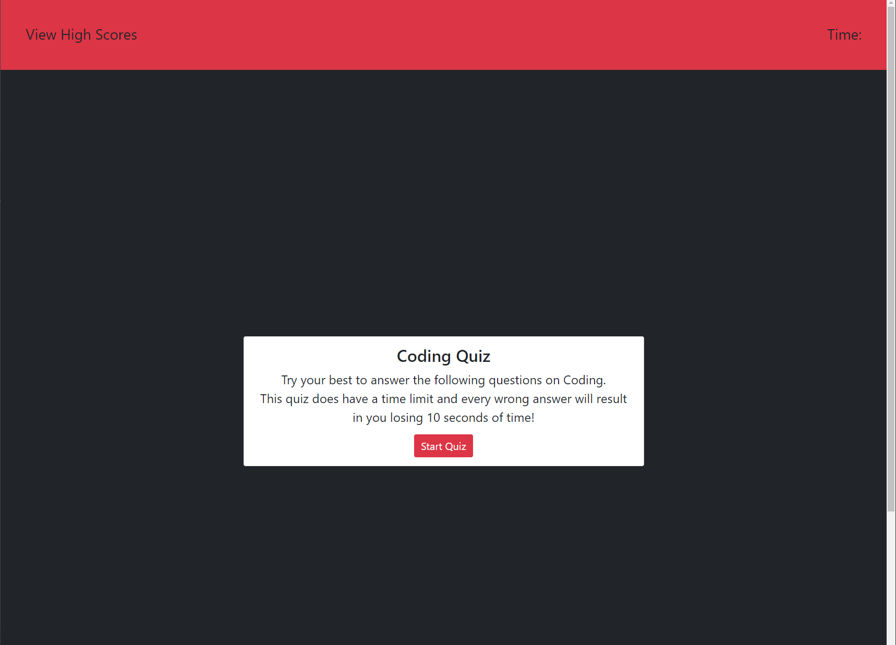

# My-Code-Quiz
## A quiz app with questions related to coding. Basically showcasing my ability to code with JavaScript and use of local storage.

## User Story

```
AS A coding boot camp student
I WANT to take a timed quiz on JavaScript fundamentals that stores high scores
SO THAT I can gauge my progress compared to my peers
```

## Acceptance Criteria

```
GIVEN I am taking a code quiz
WHEN I click the start button
THEN a timer starts and I am presented with a question
WHEN I answer a question
THEN I am presented with another question
WHEN I answer a question incorrectly
THEN time is subtracted from the clock
WHEN all questions are answered or the timer reaches 0
THEN the game is over
WHEN the game is over
THEN I can save my initials and score
```

## Changes made

- added all the necessary files to begin: index.html, style.css, script.js, etc.
- built out start quiz card and starter page for program
- linked a bootstrap styling sheet just to make styling easy for me
- built out remaining cards I needed for the program and hid them
- started making a array or questions and answers in the script.js
- declared some necessary variables
- built out the start quiz function 
- built out the end quiz function
- built an answer checker function 
- built a function to hide unused cards too


## Screenshot



## Deployed page

Page published at: https://nbross.github.io/My-Code-Quiz/
Git Hub Repo: https://github.com/nbross/My-Code-Quiz